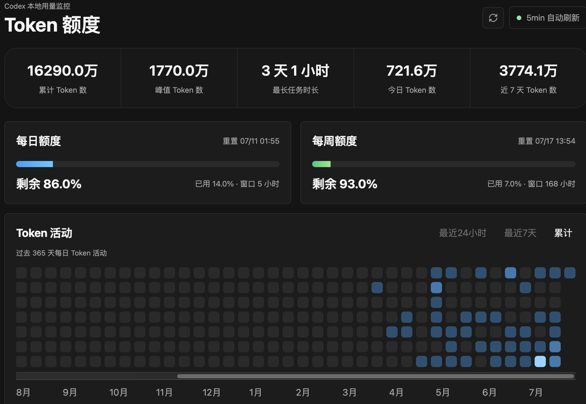

# Codex Token Monitor

English | [中文](README.zh-CN.md)

Codex Token Monitor is a local macOS desktop app for viewing Codex token usage and rate-limit activity from the data stored on your own machine.

The app runs as an Electron window. It starts a local-only HTTP service in the background, reads Codex data from `~/.codex`, and renders the dashboard in the app window. It does not upload, modify, or sync your Codex data.

## Screenshot



## Features

- Shows total tokens, peak tokens, today's usage, last 7 days usage, and longest task duration.
- Shows daily and weekly rate-limit remaining percentages when Codex has written rate-limit events.
- Charts token activity for the last 24 hours and last 7 days.
- Shows a 365-day activity heatmap.
- Lists recent Codex sessions with title, token count, and update time.
- Runs fully locally.

## Requirements

- macOS 12 or later.
- Node.js and npm for development.
- `sqlite3` available on the machine. macOS usually includes `/usr/bin/sqlite3`.
- Existing Codex local data under `~/.codex`.

If Codex has not produced token usage events yet, some sections may show empty or partial data until new Codex activity is recorded.

## Data Sources

The app reads these local Codex files:

- `~/.codex/state_5.sqlite`: session list and summarized token usage.
- `~/.codex/logs_2.sqlite`: recent token usage log entries.
- `~/.codex/sessions/**/*.jsonl`: `token_count` events, context usage, and rate-limit information.

The app only reads these files. It does not modify Codex configuration, sessions, logs, or databases.

## Privacy

All data stays on your machine. The app does not make network requests to external services. The only HTTP service it starts listens on localhost and is used by the Electron window to load the dashboard and API responses.

## Install

```bash
npm install
```

## Development

Start the Electron app:

```bash
npm run electron:dev
```

Start only the local Web service:

```bash
npm start
```

The Web service listens on `http://localhost:4317` by default. You can override the port:

```bash
PORT=4320 npm start
```

You can also change the refresh interval:

```bash
AUTO_REFRESH_INTERVAL=30s npm start
AUTO_REFRESH_INTERVAL=10m npm start
```

`AUTO_REFRESH_INTERVAL` supports `ms`, `s/sec`, `m/min`, and `h/hour` suffixes. The default is `5m`.

## Build

Build the macOS Electron app:

```bash
npm run build:mac
```

Build outputs are written to `dist/`, for example:

```text
dist/mac-arm64/Codex Token Monitor.app
dist/Codex Token Monitor-1.0.0-arm64.dmg
dist/Codex Token Monitor-1.0.0-arm64.zip
```

The default build matches the current machine architecture. An Apple Silicon Mac produces an `arm64` build. Build on an Intel Mac if you need an Intel build.

## Distribution Notes

The generated app is not signed with an Apple Developer ID by default. When sharing unsigned builds, macOS Gatekeeper may block the first launch. Users can usually right-click the app and choose Open.

For public releases, use Apple Developer ID signing and notarization before distributing the `.dmg` or `.zip`.

# Download
[Releases page](https://github.com/Icyyybro/get_codex_token/releases)

## License

MIT
